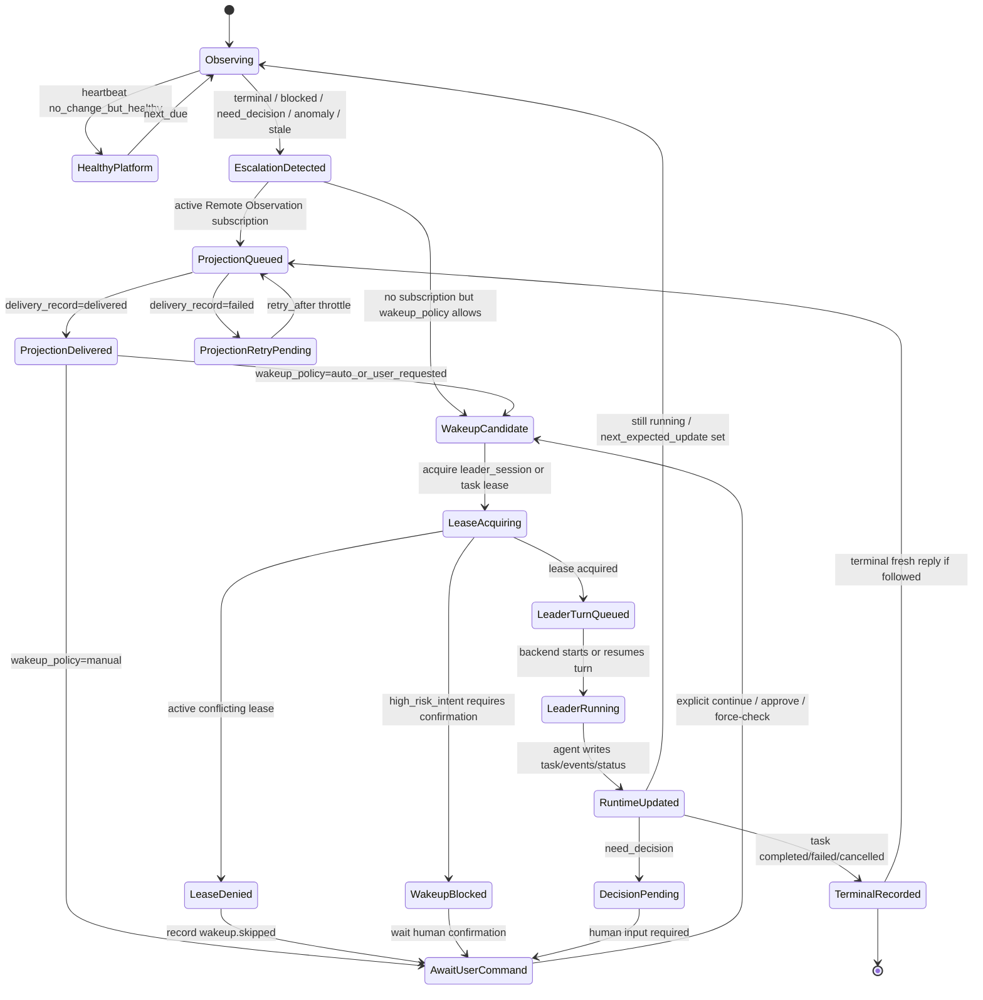

# Workflow Runtime Stategraph / LangGraph / OpenClaw Spike

> 创建时间: 2026-07-04
> 状态: dev-only spike plan
> 适用对象: Labline framework 维护者、runtime/bridge 开发 agent
> 上游设计: `CONTEXT.md`、`to-developer/plans/20260629-RUNTIME_HEARTBEAT_IMPLEMENTATION_PLAN.md`、`to-developer/plans/20260613-LANGGRAPH_EVALUATION.md`、`to-developer/plans/20260617-MULTI_PROVIDER_AGENT_FRAMEWORK_SPIKE.md`

## 0. 当前结论

现在进入 **显式状态图 + workflow runtime adapter spike** 阶段，但不把 LangGraph 或 OpenClaw 变成 Labline 核心项目格式。

触发原因:

- Feishu `/follow` 已能从 bridge-owned subscription 自动推送 `blocked` / terminal / decision 状态。
- `lane heartbeat` 已能写 healthy check、escalation 和 lease-aware skip。
- 仍缺少 `push/escalation -> lease -> Leader wakeup -> agent turn -> result record` 的 runtime owner。
- 如果直接让 bridge 在推送后启动 Leader，会把 transport adapter 变成 workflow runtime，并引入重复接手、并发改项目和高风险动作误执行。

因此下一步不是重写 bridge，而是冻结一个 Labline 原生状态图，让 LangGraph / OpenClaw 只作为可选 adapter 消费这个状态图。

## 1. 设计原则

1. **Labline runtime state 是唯一项目真相**：`.labline/runtime/` 中的 Runtime Task、events、leases、heartbeats、escalations 和 summaries 是跨 backend 的公共协议。
2. **bridge 只做 transport/observation 和可选触发**：Feishu/Lark 可以 archive、route、follow、project、submit control intent；在显式开启 auto-wakeup 时也可以调用 `lane workflow wakeup-plan` / `lane workflow wakeup`。但 bridge 不拥有 heartbeat、job、Leader session 或 workflow state，不能绕过 Labline lease、dedupe 和 runtime event。
3. **backend checkpoint 不是项目真相**：LangGraph checkpoint、OpenClaw session、Codex thread、tmux/job id 都只能作为 artifact/job handle 被引用。
4. **自动唤醒必须先拿 lease**：任何 resume/new Leader turn 前必须 acquire `leader_session` 或 `task:<task_id>` lease。
5. **默认不自动执行高风险动作**：stop/cancel/delete/overwrite/switch objective/big rerun 必须走 `control_intent` 和确认门。
6. **adapter 可替换**：没有 LangGraph/OpenClaw 时，native Codex/Claude path 仍可运行；有 adapter 时只能提升可恢复性、可视化和 orchestration。

## 2. Auto-Wakeup 状态图

这是当前 runtime 缺口的目标状态图。它描述 `heartbeat/projection` 之后如何安全唤醒 Leader，而不是描述单个 agent 的内部推理。



## 3. Runtime Task 生命周期和 Wakeup 不是一回事

Runtime Task 状态仍然使用既有 schema:

```text
new -> dispatching -> handoff_verifying -> running -> waiting_on_job
running/waiting_on_job -> stale | anomaly | need_decision | recovering
running/waiting_on_job/recovering -> completed | failed | cancelled | blocked
```

Auto-Wakeup 是围绕 task 状态的外部 supervisor graph:

- 输入: `lane status`, `lane heartbeat`, `.labline/runtime/escalations/*.json`, Remote Observation delivery state。
- 输出: `wakeup.*` runtime events、lease records、agent turn handle、updated task summary。
- 它不改写 task lifecycle enum，也不把每个 heartbeat 都变成 Leader work。

## 4. Backend Adapter 分工

| 层 | 责任 | 首选/候选 |
|---|---|---|
| State Truth | Runtime Task、events、leases、heartbeat、escalation、summary | Labline `.labline/runtime/` |
| Transport | Feishu/Lark command、follow、projection、BTW、control intent | `lark-channel-bridge` + Labline shim |
| Workflow Graph | observe/classify/lease/wakeup/record 的可恢复状态图 | native first, LangGraph optional |
| Agent Runtime | 启动/resume Codex/Claude/OpenCode/OpenHands 等执行器 | Codex CLI/app-server now; OpenClaw candidate |
| Coding Orchestration | worktree/session/approval/merge follow-through | OpenClaw/OpenHands/Cline candidate |

### LangGraph Adapter

LangGraph 适合承载 `observe -> classify -> lease -> wakeup -> record` 的可恢复状态图。它可以提供 checkpoint、interrupt、human-in-the-loop 和清晰 graph 可视化。

约束:

- LangGraph state 必须能从 `.labline/runtime/` 重建。
- LangGraph checkpoint id 可以写入 runtime event 的 artifact/job handle，但不能成为项目唯一真相。
- LangGraph node 只能通过 `lane runtime`, `lane status`, `lane heartbeat`, `labline_remote_observation.py` 等公开 helper 读写状态。
- 没安装 LangGraph 时，同一 workflow 必须能用 native poller/job service 降级运行。

### OpenClaw Adapter

OpenClaw 更适合作为 agent runtime / coding orchestration 候选，用于管理 provider、model、agent runtime、channel、session lifecycle 和 human approval。

约束:

- OpenClaw 不定义 Labline task schema。
- OpenClaw session id / runtime id 只能作为 `job_handles` 或 artifact pointer。
- OpenClaw 可以执行 Leader/Coder/Deployer turn，但必须在执行前拿 Labline lease，执行后写 Labline runtime event。
- OpenClaw 的可视化可展示 Labline 状态，但不能把 private chat id/open id 写回项目。

## 5. 最小 POC 切片

### Slice A: Native Auto-Wakeup Dry Run

目标：先不接 LangGraph/OpenClaw，只用现有 helper 输出“如果现在自动唤醒，会做什么”。

交付:

- `lane workflow wakeup-plan --project PATH --json`
- 输入: `lane status`, `.labline/runtime/escalations`, active leases。
- 输出: `action = skip | needs_confirmation | acquire_lease | start_leader_turn`。
- 只读 dry-run，不启动 agent。

验收:

- blocked task + no lease -> `acquire_lease/start_leader_turn` candidate。
- active `leader_session` lease -> `skip`。
- high-risk control intent -> `needs_confirmation`。
- healthy running -> `skip`。

### Slice B: Native Auto-Wakeup Apply

目标：最小 native job service，不引入外部 graph。

当前 v0 默认采用 **prompt-only** backend：它会拿锁、写事件并生成给 Leader 的接手 prompt，但不默认启动另一个 Codex/Claude 进程。需要真实执行时，维护者或调度器可显式传 `--backend native-codex`，让本机 `codex exec` 前台跑完一次 Leader turn；OpenClaw adapter 后续再接。

交付:

- `lane workflow wakeup --project PATH --task TASK_ID`
- acquire `leader_session` lease。
- 写 `wakeup.started` event。
- 生成一个受控 Leader turn prompt，内容只包含 runtime summary、escalation、handoff pointers，不复制飞书 transcript。
- `--backend prompt-only`：只生成 prompt，不启动 agent。
- `--backend native-codex`：调用本机 `codex exec`，Leader 结束后写 `wakeup.completed` / `wakeup.failed`，并释放 `leader_session` lease。

验收:

- 同一 escalation 只能启动一次。
- bridge 重启不会重复启动。
- lease conflict 时能收口到 `wakeup.skipped` runtime event。
- native-codex 成功/失败都能收口到 runtime event，并记录输出 artifact refs。

### Slice C: LangGraph Backend Spike

目标：验证 LangGraph 是否明显优于 native loop。

交付:

- `incubating/workflow-runtime/langgraph_autowakeup.py`
- Graph nodes: `observe`, `classify`, `acquire_lease`, `start_turn`, `record_result`, `await_human`。
- 使用同一 wakeup-plan schema。

验收:

- checkpoint 后可从中间节点恢复。
- human interrupt 可表达 `need_decision`。
- 不安装 LangGraph 时所有 stable tests 仍通过。

### Slice D: OpenClaw Runtime Spike

目标：验证 OpenClaw 是否适合作为 Leader/Coder/Deployer turn executor。

交付:

- `incubating/workflow-runtime/openclaw_runtime_adapter.md`
- 记录 OpenClaw runtime/channel/provider/session 到 Labline job handle 的映射。
- 只做 adapter contract，不接入默认 path。

验收:

- OpenClaw session 能从 Labline wakeup node 启动或引用。
- session result 能回写 runtime event。
- OpenClaw failure 不改变 task terminal verdict，除非 Labline adapter 明确写 `task.failed`。

## 6. 需要补的状态字段

后续实现 auto-wakeup 前，Runtime Task / escalation 需要能表达:

| 字段 | 位置 | 用途 |
|---|---|---|
| `wakeup_policy` | task capability 或 escalation | `manual | auto_on_terminal | auto_on_escalation | disabled` |
| `wakeup_key` | escalation / delivery / event | 同一状态只启动一次 |
| `leader_prompt_ref` | wakeup event artifact | Leader turn 的最小 prompt/handoff 文件 |
| `backend` | wakeup event / job handle | `native-codex | langgraph | openclaw | manual` |
| `backend_run_id` | wakeup event / job handle | 外部 runtime checkpoint/session id |
| `lease_scope` | wakeup event | `leader_session` 或 `task:<task_id>` |
| `confirmation_required` | control intent / wakeup plan | 高风险动作 gate |

## 7. 不做的事

- 不让 Feishu bridge 绕过 Labline runtime 直接启动 Leader；只能在显式开启时调用 `lane workflow wakeup` 这个受 lease/去重/runtime event 约束的入口。
- 不让 heartbeat 每次 due 都 resume Leader。
- 不把 LangGraph checkpoint 或 OpenClaw session 当项目真相。
- 不把所有 skill 迁移成 graph。
- 不在 stable 用户路径里强制安装 LangGraph/OpenClaw。
- 不在项目 `.labline/runtime/` 写 chat id、open id、Feishu token 或消息正文。

## 8. 下一步实现顺序

1. 本文冻结状态图和 adapter 边界。
2. 在 `tools/labline_runtime.py` 或新 helper 中实现 wakeup-plan dry-run。
3. 给 wakeup-plan 补 fake project tests。
4. 只有 dry-run 通过后，再做 native apply。
5. native apply 稳定后，做 LangGraph adapter spike。
6. OpenClaw adapter 只在需要更强 session/worktree orchestration 时进入代码实现。

## 9. 参考

- LangGraph overview / persistence / interrupts: <https://docs.langchain.com/oss/python/langgraph/overview>
- OpenClaw agent runtimes: <https://docs.openclaw.ai/concepts/agent-runtimes>
- Runtime heartbeat / Feishu projection plan: `to-developer/plans/20260629-RUNTIME_HEARTBEAT_IMPLEMENTATION_PLAN.md`
